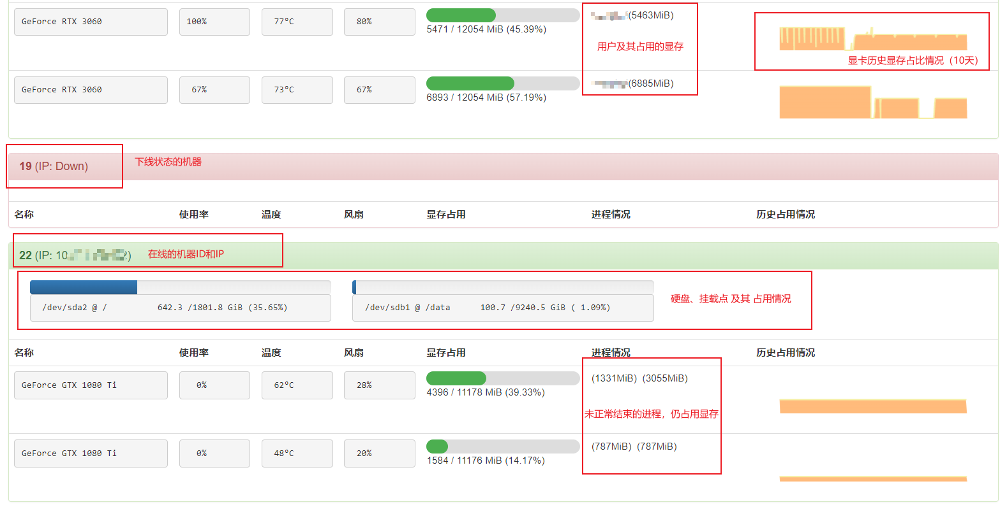

# 编译

`make -C src install`

# 本地测试

- shell-1: `GOHM_ADDR=127.0.0.1:9203 GOHM_ALLOW=127.0.0.1/8 bin/hmonitor`

- shell-2: `cp $setting bin/settings.py ; bin/main.py`

- 浏览器打开:  `http://{IP}:5000`

# 部署上线

- 将`bin/hmonitor`拷贝到要监控的主机上，在要监控的机器上运行`hmonitor`， 依赖`NVML`（nvidia的库，这也是nvidia-smi的依赖），能用nvidia-smi就能用hmonitor，主要是各个机器的`python`不统一，有的没`pip`，所以采用直接部署可执行文件的方式
 

- 将整个`bin`目录拷贝到管理主机上，在管理主机上运行`main.py`，依赖库`grpcio grpcio-tools flask`，需要在`bin`目录下创建`settings.py`

- 为了实现非管理员读取用户过期时间的功能，需要将每个被监控主机上运行`hmonitor`的用户，加入到`shadow`组中，该组对`/etc/shadow`和`/etc/gshadow`拥有只读权限(当然实际上是通过crontab部署的，所以自动有root权限，这里说的是本地测试，或者专门创建用户运行`host-monitor`的情况)
# 自动运行

- 目前测试发现所有机器都有cron，且都处于active状态

- 测试命令`parallel-ssh -i -h new-hostnames 'service cron status | grep -e "Main PID" -e "start/running"'`

- 逐个在要部署的机器上，使用`sudo crontab -e`添加如下的一行，请不要直接修改`crontab`文件，而是使用`crontab`命令
```
*/5 * * * * GOHM_ADDR=0.0.0.0:9203 GOHM_ALLOW=<PLEASE CHANGE> run-one <PATH-TO-HOST-MONITOR>
```

- 系统初始化方式：`SysV init`（早期） --> `UpStart`（过渡） --> `systemd`（目前主流）
  
- 通过`sudo stat /proc/1/exe | grep File:`可以查看系统的初始化方式，有少部分机器仍是`SysV init`，大部分机器是`systemd`，难以一致地配置`host-monitor`的自启动，所以采用了定时任务的方式实现自动运行

- 依赖于工具run-one, 防止重复运行

# settings.py

- 形如

```python
# 要监控的服务器上部署的后端监听的地址
servers = {"local": "127.0.0.1:9203"}
# flask用于加密cookie等操作的secret
secret = "asdjfoihasidhfu"
# 简单登录用的token
token = "123456"
```

# 一些说明

- hmonitor不需要管理员权限，环境变量GOHM_ADDR为监听的地址和端口，GOHM_ALLOW为允许访问API的机器，如10.1.2.3/32表示只有管理主机10.1.2.3允许获取每个机器的状态，设置成前端所部署在的服务器即可
  
- 前端也不需要管理员权限

- main.go中为了获取本机ip，硬编码了"10."，即在所有IP中最后一个10.开头的，才会显示在hostInfo.Ip中，否则该机器IP在前端会显示成空，对监控没影响

- 所有通信都未经过加密，如果有证书，可以使用SSL/TLS

- 本代码中未包含与实验室具体IP相关的参数，运行时需要自行设定`GOHM_ALLOW GOHM_ADDR settings.py`

# 原理

- 显卡监控部分：`NVML(NVIDIA Management Library)`

- 硬盘监控部分：读取`/proc/mounts`，获取所有挂载类型为`ext?`的挂载点，获得其容量和占用信息

- 主机间通信部分：protobuf + gRPC

- 前端、前后端通信：flask + protobuf + base64

- 读取用户账号过期时间：解析/etc/shadow，该文件`默认`属于`shadow`用户组，所以通过将后端用户加入到shadow组中即可，shadow组对其具有只读权限，这种方式操作相对安全

# 效果




# protobuf

- 下面是具体的protobuf定义

```protobuf
syntax = "proto3";
package gpu;
option go_package=".";
message ProcInfo {
    uint32 pid = 1;
    int32 uid = 2;
    string username = 3;
    string basename = 4;
    uint64 expiration = 5;
    int32 utilization = 6;
    uint64 mem = 7;
}
message GPUInfo{
    int32 id = 1;
    uint64 mem_used = 2;
    uint64 mem_total = 3;
    int32 utilization = 4;
    uint32 temp = 5;
    string name = 6;
    uint32 fanspeed = 7;
    repeated ProcInfo procs = 8;
}
message DiskInfo {
    string device = 1;
    uint64 used = 2;
    uint64 total = 3;
    string mount = 4;
}
message HostInfo {
    string id = 1;
    repeated GPUInfo gpus = 2;
    repeated DiskInfo disks = 3;
    string ip = 4;
    string hostname = 5;
    string err = 6;
}


message RequestInfo {
    string token = 1; // reserved
    string reqtype = 2; 
}

service HostMonitor {
    rpc GetInfo (RequestInfo) returns (HostInfo) {}
}

message HistReq{
    string id = 1;
    uint64 timestamp = 2;
    string type = 3;
}

message HistResp{
    repeated uint64 t = 1;
    repeated uint64 v = 2;
}

message HistMap{
    map<string, HistResp> data = 1;
}

service History {
    rpc GetHistory (HistReq) returns (HistResp) {}
}
```

# 开发环境所需依赖

- golang 1.17+
- github.com/golang/protobuf/protoc-gen-go
- python 3.7+
- python: flask grpcio grpcio-tools
- protobuf编译器: protoc（使用apt安装或github上下载可执行文件）
